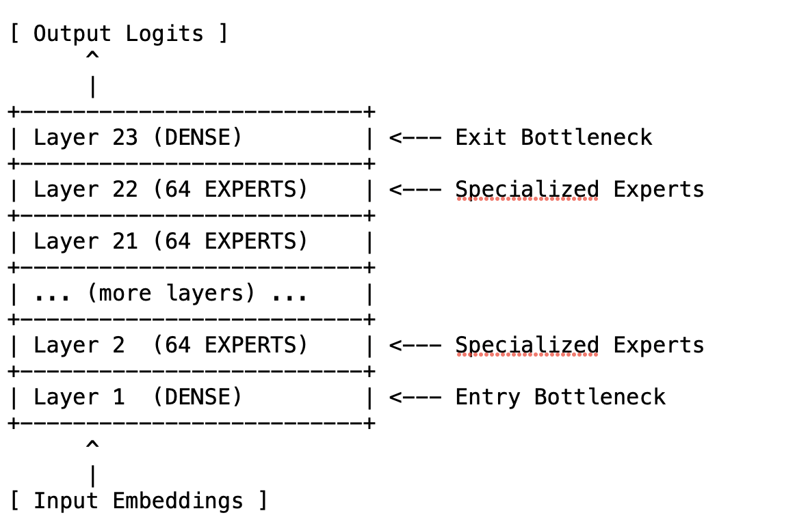
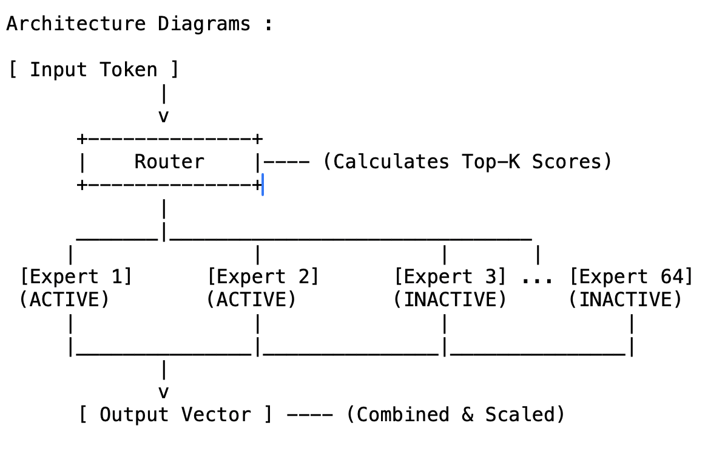

# Aim - MoEfication

MoEfication is a model compression technique that transforms a standard **dense** transformer model into a sparse **Mixture-of-Experts (MoE)** architecture. This allows the model to activate only a small fraction of its parameters (neurons) for any given input, significantly reducing computational costs while maintaining performance.

## Basic Steps

1. **Neuron Partitioning (Clustering)**  
   The thousands of neurons within each MLP layer are grouped into distinct `"experts"`. Using **K-Means Constrained** ensures that every expert has exactly the same number of neurons, which prevents signal collapse.

2. **Oracle Routing (Scoring)**  
   For every incoming token, the model calculates which experts are most *excited* by that specific input. In research settings, this often uses the actual activation magnitudes to find the most relevant experts.

3. **Top-K Selection**  
   A gatekeeper (the **Router**) selects only the **Top-K** highest‑scoring experts to remain active. For a 64‑expert setup, choosing \(K=32\) means the token only uses 50% of the available neurons in that layer.

4. **Dynamic Masking**  
   The neurons belonging to the non‑selected experts are temporarily *silenced* (set to zero). The final output is calculated only using the active experts, often scaled up to compensate for the missing energy.

## Architecture Diagrams

1. **Overall Flow :** 

2. **Per Layer Flow :**

